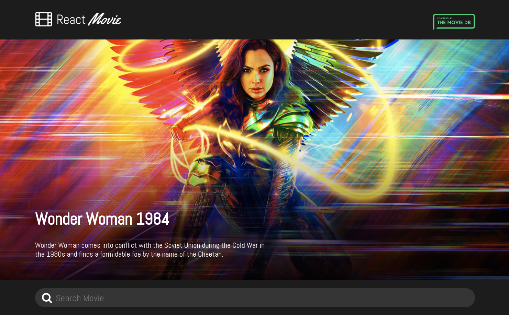

<h1 align="center">
  
</h1>

<p align="center">
  <a href="#-project">Project</a>&nbsp;&nbsp;&nbsp;|&nbsp;&nbsp;&nbsp;
  <a href="#-technologies">Technologies</a>&nbsp;&nbsp;&nbsp;|&nbsp;&nbsp;&nbsp;
  <a href="#-features">Features</a>&nbsp;&nbsp;&nbsp;|&nbsp;&nbsp;&nbsp;
  <a href="#-how-to-run">How to run</a>&nbsp;&nbsp;&nbsp;|&nbsp;&nbsp;&nbsp;
  <a href="#memo-license">License</a>
</p>

<p>
  
</p>

## :computer: Project

<strong> You can view the app site here:</strong>
* https://react-movie-app-al.netlify.app/

## :rocket: Technologies

* [ReactJS](https://reactjs.org/)

* [Styled-Components](https://styled-components.com/)

* [TMDB API](https://www.themoviedb.org/)

* [Netlify](https://www.netlify.com/) - deploy

## :tada: Features

## :construction_worker: How to run

```bash
# Clone repository
$ git clone https://github.com/alauraivani/react-movie-app
   
# Go to project folder
$ cd react-movie-app
   
# Install dependencies
$ yarn install
   
# Run Application
$ yarn start
   
```
